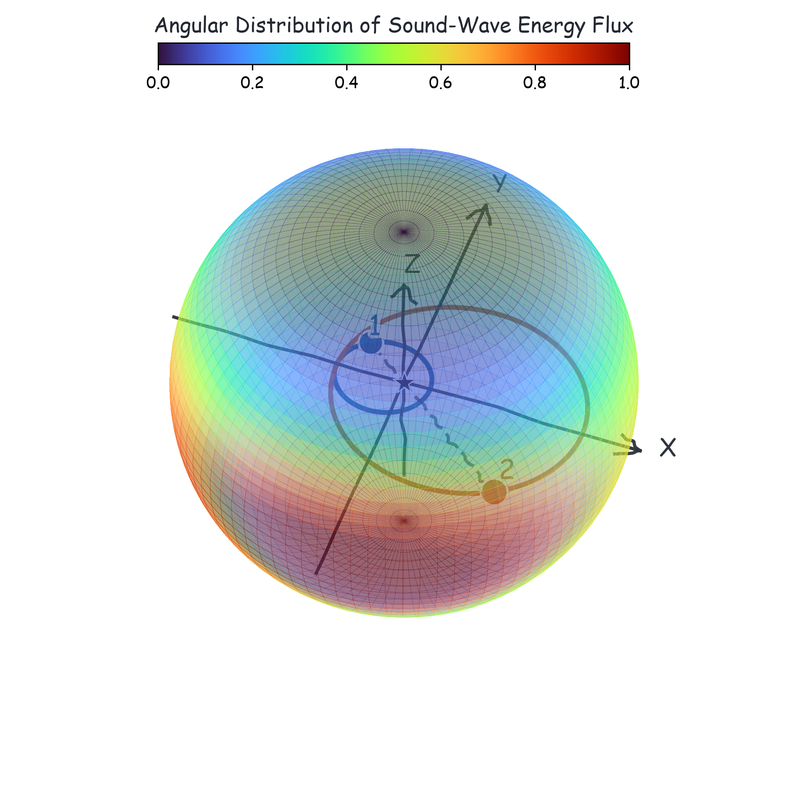

# Binary Fluid Sound-Wave Flux Calculators

Numerical calculators for sound-wave fluxes from eccentric binary orbits in
classical and quantum fluids.

The code evaluates the harmonic sums with automatic convergence checks and can
use CUDA acceleration through `numba.cuda` when available.  CPU execution is
also supported.

<p align="center">
  
</p>
<p align="center">
  <em>(parameters: nu=0.20, e=0.45, n0=0, A=a*Omega/c_s=0.55)</em>
</p>

## Contents

- `classic_fluid_power.py`: classical-fluid normalized power
  `P/(2*rho_bar*M^2/c_s)`.
- `classic_fluid_tau_z.py`: classical-fluid normalized angular-momentum flux
  `tau_z*Omega/(2*rho_bar*M^2/c_s)`.
- `classic_fluid_force_y.py`: classical-fluid normalized y-force
  `F_y/(2*rho_bar*M^2/c_s^2)`.
- `quantum_fluid.py`: quantum-fluid normalized `P`, `tau_z`, and `F_y`.
- `quadrupole_fluxes.py`: general quadrupole-approximation fluxes for
  classical and quantum fluids.
- `single_perturber_classic.py`: fixed-center single-perturber classical limit.
- `eytan_sound_wave_coefficients.py`: finite-cutoff
  Eytan--Desjacques--Ginat single-perturber coefficient calculator.
- `classic_fluid_quadrupole.py`: closed-form massless classical quadrupole
  formulas.
- `FORMULAS.md`: formula transcription and normalization notes.
- `examples/quickstart.py`: small smoke-test style usage example.
- `paper_plots/`: scripts used to generate representative paper-style figures.

## Parameters

The symmetric mass ratio is

```text
nu = m1*m2/(m1+m2)^2,    0 < nu <= 1/4.
```

The Keplerian orbit uses eccentricity `e` and eccentric anomaly `xi`,

```text
X/a = (cos xi - e, sqrt(1-e^2) sin xi, 0),
Omega*t = xi - e*sin xi.
```

Classical-fluid calculators use

```text
A = a*Omega/c_s,
n0 = m/Omega.
```

Quantum-fluid calculators use

```text
A = M_Q = a*sqrt(Omega),
n0 = m/Omega.
```

For the quantum-fluid outputs,

```text
P_hat   = P/(2*rho_bar*M^2*m_phi/sqrt(Omega)),
tau_hat = tau_z*tildeOmega/(2*rho_bar*M^2*m_phi/sqrt(Omega)),
Fy_hat  = F_y*sqrt(Omega)/m_phi/(2*rho_bar*M^2*m_phi/sqrt(Omega)).
```

## Installation

Create a Python environment and install the runtime dependencies:

```powershell
pip install -r requirements.txt
```

CUDA acceleration requires a working NVIDIA CUDA setup supported by Numba.
If CUDA is unavailable, use `backend="cpu"` or `backend="auto"`.

## Quick Start

```powershell
python examples/quickstart.py
```

Direct CLI example:

```powershell
python classic_fluid_power.py --nu 0.25 --e 0.2 --n0 0 --A 0.5 --backend auto
python quantum_fluid.py --quantity power --nu 0.25 --e 0.2 --n0 0 --A 2.0 --backend auto
python eytan_sound_wave_coefficients.py --Mach 0.5 --e 0.2 --jmax 20 --lmax 13
```

Minimal Python example:

```python
from classic_fluid_power import classical_fluid_power
from eytan_sound_wave_coefficients import eytan_sound_wave_coefficients
from quantum_fluid import quantum_fluid_power

classic = classical_fluid_power(nu=0.25, e=0.2, n0=0.0, A=0.5, backend="auto")
quantum = quantum_fluid_power(nu=0.25, e=0.2, n0=0.0, A=2.0, backend="auto")
eytan = eytan_sound_wave_coefficients(Mach=0.5, e=0.2, jmax=20, lmax=13)

print(classic.value)
print(quantum.value)
print(eytan.P_shape)
```

## Paper-Style Plots

The scripts in `paper_plots/` write outputs below an `outputs/` directory.
For example:

```powershell
python paper_plots/plot_paper_fig3_classical_nu02_ecc_fluxes.py
python paper_plots/plot_paper_fig3_quantum_nu02_ecc_fluxes.py
```

These scripts intentionally use moderate grids by default.  Increase
`--n-max`, `--n-mu`, `--n-phi`, or decrease `--rtol` for production runs.

## Notes

- The infinite harmonic sum is not returned at an arbitrary cutoff by default.
  The calculators evaluate chunks of harmonics until recent tail contributions
  are below the requested tolerance for several consecutive checks.
- Classical-fluid point-source calculations have a built-in large-harmonic
  speed-threshold guard.
- Please verify convergence settings for each new parameter regime.

## References

- G. Eytan, V. Desjacques, and Y. B. Ginat, arXiv:2509.15632.  We only
  implement the single-perturber version in
  `eytan_sound_wave_coefficients.py`.
