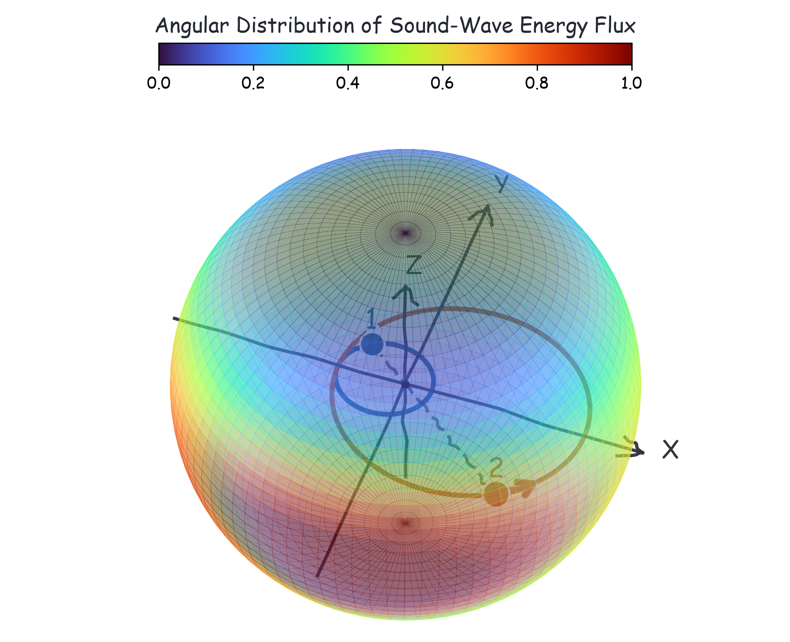

# Binary Fluid Sound-Wave Flux Calculators

Numerical calculators for the time-averaged linear sound-wave fluxes generated by bound Keplerian binaries in homogeneous classical-fluid and quantum-fluid backgrounds at rest in the binary center-of-mass frame.

The numerical calculators evaluate the harmonic sums with automatic convergence checks. They support CUDA acceleration through `numba.cuda` when available and can also run on the CPU.

<p align="center"></p>
<p align="center">(parameters: <code>nu=0.20</code>, <code>e=0.45</code>, <code>n0=0</code>, <code>A=a*Omega=0.55</code>)</p>

## Contents

- `classic_fluid_power.py`: normalized classical-fluid power, `P/(2*rho_bar*M^2/c_s)`.
- `classic_fluid_tau_z.py`: normalized classical-fluid angular-momentum flux, `tau_z*tildeOmega/(2*rho_bar*M^2/c_s)`.
- `classic_fluid_force_y.py`: normalized y-component of the classical-fluid linear-momentum flux, `F_y/(2*rho_bar*M^2/c_s^2)`.
- `quantum_fluid.py`: normalized quantum-fluid energy, angular-momentum, and linear-momentum fluxes, `P`, `tau_z`, and `F_y`.
- `quadrupole_fluxes.py`: classical-fluid and $c_S=0$ quantum-fluid fluxes at quadrupole order (quadrupole + monopole radiation).
- `single_perturber_classic.py`: classical-fluid flux calculator for a fixed-center single perturber, using the same harmonic-sum method as the binary calculators.
- `eytan_sound_wave_coefficients.py`: finite-cutoff calculator for the $n_0=0$ Eytan--Desjacques--Ginat single-perturber coefficients.
- `classic_fluid_quadrupole.py`: closed-form $n_0=0$ classical-fluid fluxes at quadrupole order.
- `examples/quickstart.py`: minimal usage example and smoke test.
- `paper_plots/`: scripts used to generate the paper figures provided in this repository.

## Parameters

The calculators use dimensionless parameters defined through the auxiliary-time wave equation. The following symbols are used throughout:

```text
rho_bar     homogeneous background mass density
tildeOmega  physical orbital angular frequency, T = 2*pi/tildeOmega
Omega       orbital frequency in the auxiliary time
m           effective Jeans/tachyonic mass in the auxiliary-time equation
n0          m/Omega
c_s         classical-fluid sound speed
m_phi       scalar-particle mass in the quantum-fluid case
```

The total binary mass is `M = m1 + m2`, and the symmetric mass ratio is

```text
nu = m1*m2/(m1+m2)^2,    0 < nu <= 1/4.
```

The relative Keplerian orbit is parameterized by the eccentricity `e` and eccentric anomaly `xi`:

```text
X/a = (cos xi - e, sqrt(1-e^2) sin xi, 0),
tildeOmega*t_phys = xi - e*sin xi.
```

For the classical Newtonian fluid, the code uses the orbital Mach number $\mathcal{M}=a\Omega=a\tilde\Omega/c_s$:

```text
A = a*Omega = a*tildeOmega/c_s.
```

The auxiliary and physical quantities are related by

```text
t_aux = c_s*t_phys,
Omega = tildeOmega/c_s,
m^2 = 4*pi*rho_bar/c_s^2,
n0 = m/Omega = sqrt(4*pi*rho_bar)/tildeOmega,
rho_bar = (n0*tildeOmega)^2/(4*pi) = c_s^2*m^2/(4*pi).
```

For `n > 0`, the classical radiating wavenumber is

```text
k_n = Omega*sqrt(n^2+n0^2),
a*k_n = A*sqrt(n^2+n0^2).
```

For the Schrödinger-Poisson quantum fluid, the code uses the dimensionless orbital parameter $\mathcal{M}_Q=a\sqrt{\Omega}$:

```text
A = a*sqrt(Omega).
```

The auxiliary and physical quantities are related by

```text
t_aux = t_phys/(2*m_phi),
Omega = 2*m_phi*tildeOmega,
m^2 = 16*pi*m_phi^2*rho_bar,
n0 = m/Omega = sqrt(4*pi*rho_bar)/tildeOmega,
rho_bar = (n0*tildeOmega)^2/(4*pi) = m^2/(16*pi*m_phi^2).
```

For `n > 0` in the default $c_S=0$ case, the radiating wavenumber is

```text
k_n = sqrt(Omega)*(n^2+n0^2)^(1/4),
a*k_n = A*(n^2+n0^2)^(1/4).
```

The default calculation sets $c_S=0$. A finite quantum-fluid sound-speed term is specified by `cS2_over_Omega` ($c_S^2/\Omega \in \mathbb{R}$).

The binary flux calculators return dimensionless normalized quantities. Here, `P`, `tau_z`, and `F_y` denote the energy flux, the z-component of the angular-momentum flux, and the y-component of the linear-momentum flux, respectively. For a homogeneous classical-fluid background of density `rho_bar`, the outputs correspond to

```text
P     = (2*rho_bar*M^2/c_s) * P_hat,
tau_z = (2*rho_bar*M^2/c_s) * tau_hat/tildeOmega,
F_y   = (2*rho_bar*M^2/c_s^2) * Fy_hat.
```

For the quantum-fluid outputs, the normalizations are

```text
P_hat   = P/(2*rho_bar*M^2*m_phi/sqrt(Omega)),
tau_hat = tau_z*tildeOmega/(2*rho_bar*M^2*m_phi/sqrt(Omega)),
Fy_hat  = F_y*sqrt(Omega)/m_phi/(2*rho_bar*M^2*m_phi/sqrt(Omega)).
```

Equivalently, the physical fluxes are

```text
P     = (2*rho_bar*M^2*m_phi/sqrt(Omega)) * P_hat,
tau_z = (2*rho_bar*M^2*m_phi/sqrt(Omega)) * tau_hat/tildeOmega,
F_y   = (2*rho_bar*M^2*m_phi^2/Omega) * Fy_hat.
```

Consequently, the same dimensionless `n0` is used for the classical and quantum fluids:

```text
n0 = sqrt(4*pi*rho_bar)/tildeOmega.
```

The fixed-center single-perturber calculator `single_perturber_classic.py` uses the same classical parameter, `A = a*Omega = a*tildeOmega/c_s`, and returns

```text
single_perturber_power().value = P/(2*rho_bar*m_p^2/c_s),
single_perturber_tau_z().value = tau_z*tildeOmega/(2*rho_bar*m_p^2/c_s),
single_perturber_force_y().value = F_y/(2*rho_bar*m_p^2/c_s^2).
```

Here, `m_p` denotes the perturber mass.

The Eytan--Desjacques--Ginat helper `eytan_sound_wave_coefficients.py` calculates the $n_0=0$ fixed-center single-perturber coefficients. It uses `A = a*Omega = a*tildeOmega/c_s`. The returned `P_shape` and `tau_z_shape` are converted to normalized single-perturber fluxes according to

```text
P/(2*rho_bar*m_p^2/c_s) = 2*pi*P_shape,
tau_z*tildeOmega/(2*rho_bar*m_p^2/c_s) = 2*pi*A*tau_z_shape.
```

## Installation

Install the runtime dependencies in a Python environment:

```powershell
pip install -r requirements.txt
```

CUDA execution requires an NVIDIA CUDA setup supported by Numba. When CUDA is unavailable, use `backend="cpu"` or `backend="auto"`.

## Quick Start

```powershell
python examples/quickstart.py
```

Command-line examples:

```powershell
python classic_fluid_power.py --nu 0.25 --e 0.2 --n0 0 --A 0.5 --backend auto
python quantum_fluid.py --quantity power --nu 0.25 --e 0.2 --n0 0 --A 2.0 --backend auto
python eytan_sound_wave_coefficients.py --A 0.5 --e 0.2 --jmax 20 --lmax 13
```

A minimal Python example:

```python
from classic_fluid_power import classical_fluid_power
from eytan_sound_wave_coefficients import eytan_sound_wave_coefficients
from quantum_fluid import quantum_fluid_power

classic = classical_fluid_power(nu=0.25, e=0.2, n0=0.0, A=0.5, backend="auto")
quantum = quantum_fluid_power(nu=0.25, e=0.2, n0=0.0, A=2.0, backend="auto")
eytan = eytan_sound_wave_coefficients(A=0.5, e=0.2, jmax=20, lmax=13)

print(classic.value)
print(quantum.value)
print(eytan.P_shape)
```

## Paper Plots

The scripts in `paper_plots/` save their output under `outputs/paper_plots/`.

```powershell
python paper_plots/plot_circular_power_nu.py
python paper_plots/plot_paper_fig1_emri_fluxes.py
python paper_plots/plot_paper_fig3_nu02_ecc_fluxes.py
python paper_plots/plot_quantum_equal_mass_power_curves.py
python paper_plots/plot_paper_fig3_quantum_nu02_ecc_fluxes.py
```

## Notes

- By default, the infinite harmonic sums are evaluated adaptively rather than truncated at a fixed harmonic. Successive chunks are included until the recent tail contributions remain below the requested tolerance for several consecutive checks.
- The classical-fluid binary calculators check the large-harmonic divergence criterion before evaluating the sum.
- Please verify convergence settings for each new parameter regime.
- The quantum fluid is treated as a classical field.

## References

- G. Eytan, V. Desjacques, and Y. B. Ginat, [arXiv:2509.15632](https://arxiv.org/abs/2509.15632). This repository implements only their single-perturber result in `eytan_sound_wave_coefficients.py`.

# Periastron Precession Calculators

The `precession/` module calculates the conservative periastron precession of an eccentric binary in homogeneous classical-fluid and quantum-fluid backgrounds at rest in the binary center-of-mass frame, using a time-symmetric linear response prescription.  Its parameter adapters use the same `nu`, `e`, `n0`, and `A` conventions as the flux calculators: `A = a*Omega` for a classical fluid and `A = a*sqrt(Omega)` for a quantum fluid.  Self-gravity may be included or omitted for either fluid.  `precession_calculator.py` provides the command-line interface; the default point-source implementation uses real-space response kernels, while the finite-window CUDA/principal-value route is retained for validation.
